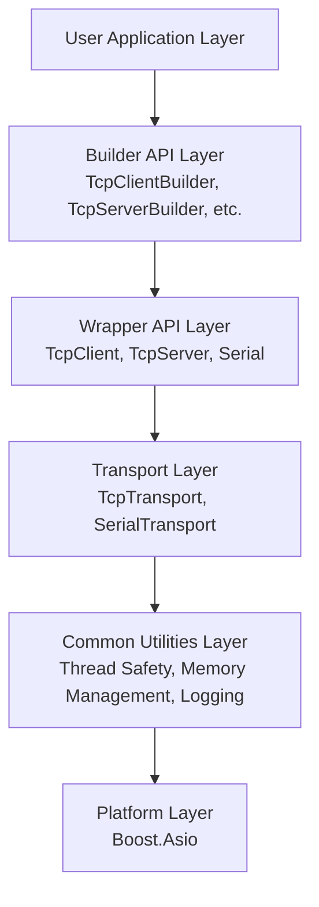
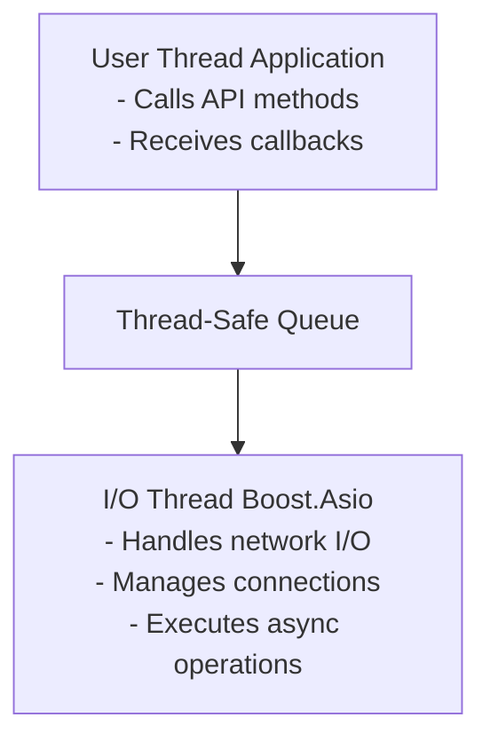
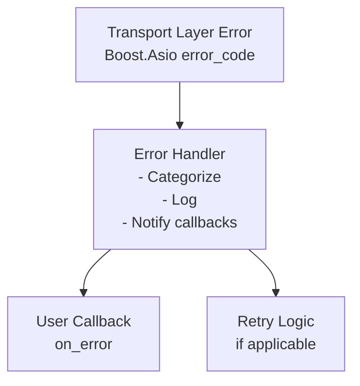

# Unilink System Architecture {#contrib_arch}

Comprehensive overview of unilink's architecture and design principles.

**Scope note:** This section mixes public high-level concepts with internal implementation details. For exact application-facing APIs, prefer `docs/user/api_guide.md`. For transport-internal contracts, prefer `docs/contributor/architecture/channel_contract.md`. For wrapper-layer behavioral guarantees, prefer `docs/contributor/architecture/wrapper_contract.md`.

---

## Table of Contents

1. Overview
2. Layered Architecture
3. Core Components
4. Design Patterns
5. Threading Model
6. Memory Management
7. Error Handling
8. Development & Tooling

---

## Overview

Unilink is designed as a layered, modular communication library with clear separation of concerns. The architecture follows SOLID principles and employs modern C++ design patterns.

### Design Goals

- **Simplicity**: Easy-to-use Builder API
- **Safety**: Memory-safe, thread-safe operations
- **Performance**: Asynchronous I/O, efficient resource management
- **Flexibility**: Modular design, optional features
- **Reliability**: Comprehensive error handling and recovery

---

## Layered Architecture



### Layer Responsibilities

#### 1. Builder API Layer

- **Purpose**: Provide fluent, chainable interface
- **Components**: `TcpClientBuilder`, `TcpServerBuilder`, `SerialBuilder`, `UdpClientBuilder`, `UdpServerBuilder`, `UdsClientBuilder`, `UdsServerBuilder`
- **Responsibilities**:
  - Configuration validation
  - Object construction
  - Callback registration

#### 2. Wrapper API Layer

- **Purpose**: High-level, easy-to-use interfaces
- **Components**: `TcpClient`, `TcpServer`, `Serial`, `UdpClient`, `UdpServer`, `UdsClient`, `UdsServer`
- **Responsibilities**:
  - Connection management
  - Data transmission
  - Lifecycle management
  - Event callbacks

#### 3. Transport Layer

- **Purpose**: Low-level communication implementation
- **Components**: Protocol-specific transports
- **Responsibilities**:
  - Actual I/O operations
  - Protocol handling
  - Connection state management

#### 4. Common Utilities Layer

- **Purpose**: Shared functionality
- **Components**: Thread safety, memory management, logging
- **Responsibilities**:
  - Thread-safe operations
  - Memory tracking
  - Error handling
  - Logging system

---

## Core Components

### 1. Builder System

```cpp
namespace unilink::builder {
    // Base interface (CRTP: T = product type, Derived = builder type)
    template<typename T, typename Derived>
    class BuilderInterface { ... };

    // Concrete builders
    class TcpClientBuilder : public BuilderInterface<wrapper::TcpClient, TcpClientBuilder>;
    class TcpServerBuilder : public BuilderInterface<wrapper::TcpServer, TcpServerBuilder>;
    class SerialBuilder     : public BuilderInterface<wrapper::Serial,    SerialBuilder>;
    class UdpClientBuilder  : public BuilderInterface<wrapper::UdpClient, UdpClientBuilder>;
    class UdpServerBuilder  : public BuilderInterface<wrapper::UdpServer, UdpServerBuilder>;
    class UdsClientBuilder  : public BuilderInterface<wrapper::UdsClient, UdsClientBuilder>;
    class UdsServerBuilder  : public BuilderInterface<wrapper::UdsServer, UdsServerBuilder>;
}
```

**Key Features:**

- Method chaining
- Type-safe configuration
- Compile-time validation
- Auto-initialization support

### 2. Wrapper System

```cpp
namespace unilink::wrapper {
    class ChannelInterface {
        virtual std::future<bool> start() = 0;
        virtual void stop() = 0;
        virtual bool connected() const = 0;
        virtual bool send(std::string_view data) = 0;
        virtual bool send_line(std::string_view line) = 0;
    };

    class ServerInterface {
        virtual std::future<bool> start() = 0;
        virtual void stop() = 0;
        virtual bool listening() const = 0;
        virtual bool broadcast(std::string_view data) = 0;
        virtual bool send_to(ClientId client_id, std::string_view data) = 0;
    };

    class TcpClient : public ChannelInterface;
    class Serial : public ChannelInterface;
    class UdpClient : public ChannelInterface;
    class UdsClient : public ChannelInterface;
    class TcpServer : public ServerInterface;
    class UdsServer : public ServerInterface;
}
```

**Key Features:**

- Unified interface
- Automatic resource management
- Callback-based events
- Thread-safe operations

### 3. Transport System

```cpp
namespace unilink::transport {
    // TCP transport
    class TcpClient { ... };
    class TcpServer { ... };
    class TcpServerSession { ... };

    // Serial transport
    class Serial { ... };
}
```

**Key Features:**

- Boost.Asio based
- Asynchronous I/O
- Retry logic (1s default interval, first retry at 100ms)
- Backpressure guard: callback at high watermark (default 1 MiB), hard cap triggers socket close + Error state

### 4. Common Utilities

```cpp
namespace unilink {
namespace concurrency {
    template<typename T> class ThreadSafeState;
    template<typename T> class AtomicState;
}

namespace memory {
    class MemoryPool;
    class MemoryTracker;
    class SafeDataBuffer;
}

namespace diagnostics {
    class Logger;
    class LogRotation;
    class ErrorHandler;
}
}
```

---

## Design Patterns

### 1. Builder Pattern

**Purpose**: Simplify object creation with many parameters

```cpp
// Instead of this:
TcpClient(host, port, retry_interval, callbacks...);

// We use this:
auto client = tcp_client(host, port)
    .retry_interval(3000ms)  // Optional; default is 1000ms
    .on_data(callback)
    .build();

client->start();  // Explicit lifecycle control
```

**Benefits:**

- Readable configuration
- Optional parameters
- Compile-time validation
- Method chaining

### 2. Dependency Injection

**Purpose**: Enable testability and flexibility

```cpp
// Interface-based design
class ISerialPort {
    virtual void open() = 0;
    virtual void close() = 0;
    virtual void async_read(...) = 0;
};

// Production implementation
class RealSerialPort : public ISerialPort { ... };

// Test implementation
class MockSerialPort : public ISerialPort { ... };

// Injection in constructor
Serial::Serial(std::shared_ptr<ISerialPort> port) : port_(port) { }
```

### 3. Observer Pattern

**Purpose**: Event notification system

```cpp
class TcpClient {
    std::function<void(const ConnectionContext&)> on_connect_;
    std::function<void(const MessageContext&)>    on_data_;
    std::function<void(const ConnectionContext&)> on_disconnect_;
    std::function<void(const ErrorContext&)>      on_error_;

    void notify_connect(const ConnectionContext& ctx) {
        if (on_connect_) on_connect_(ctx);
    }

    void notify_data(const MessageContext& ctx) {
        if (on_data_) on_data_(ctx);
    }
};
```

### 4. Singleton Pattern

**Purpose**: Global access to shared resources

```cpp
class Logger {
public:
    static Logger& instance() {
        static Logger instance;
        return instance;
    }

private:
    Logger() = default;
    Logger(const Logger&) = delete;
    Logger& operator=(const Logger&) = delete;
};
```

### 5. RAII (Resource Acquisition Is Initialization)

**Purpose**: Automatic resource management

```cpp
class TcpClient {
    ~TcpClient() {
        // Automatically stop and clean up
        stop();
    }

    std::unique_ptr<IoContext> io_context_;  // Auto-deleted
    std::shared_ptr<Connection> connection_; // Ref-counted
};
```

### 6. Template Method Pattern

**Purpose**: Define algorithm structure with customizable steps

```cpp
class ChannelInterface {
    void start() {
        before_start();
        do_start();      // Virtual - customizable
        after_start();
    }

protected:
    virtual void do_start() = 0;
    virtual void before_start() {}
    virtual void after_start() {}
};
```

---

## Threading Model

**Note:** For a detailed execution model, see [Runtime Behavior](runtime_behavior.md).

### Overview



### Thread Safety Model

#### 1. Runtime Methods

Runtime operations such as sending, stopping, and state inspection are designed for concurrent application use. Callback registration and configuration setters should normally be completed before startup.

```cpp
// Safe to call from multiple application threads
client->send("data1");  // Thread 1
client->send("data2");  // Thread 2
client->stop();         // Thread 3
```

#### 2. Callbacks

Callbacks are executed in the I/O thread context:

```cpp
.on_data([](const unilink::MessageContext& ctx) {
    // This runs in the I/O thread.
    // Don't block here!
});
```

#### 3. Shared State

All shared state is protected:

```cpp
class TcpClient {
    ThreadSafeState<State> state_;  // Thread-safe
    std::atomic<bool> connected_;   // Atomic
    std::mutex write_mutex_;        // Explicit lock
};
```

### IO Context Management

#### Shared Context (Default)

```cpp
// Multiple channels share one I/O thread
auto client1 = tcp_client("server1.com", 8080).build();
auto client2 = tcp_client("server2.com", 8080).build();
// Both use shared IoContextManager
```

**Pros:**

- Efficient resource usage
- Single I/O thread handles all connections

**Cons:**

- All connections share same thread

#### Independent Context

```cpp
// Each channel has its own I/O thread
auto client = tcp_client("server.com", 8080)
    .independent_context(true)
    .build();
```

**Pros:**

- Isolation between connections
- Useful for testing

**Cons:**

- More resource usage
- More threads

---

## Memory Management

### 1. Smart Pointers

```cpp
// Ownership
std::unique_ptr<TcpClient> client_;  // Exclusive ownership
std::shared_ptr<Session> session_;   // Shared ownership
std::weak_ptr<Connection> conn_;     // Non-owning reference
```

### 2. Memory Pool

For high-performance scenarios, transports use a bucketed pool and an RAII buffer wrapper.

```cpp
// Acquire/release with size buckets (1KB/4KB/16KB/64KB)
auto buf = GlobalMemoryPool::instance().acquire(4096);
// ... use buf.get() ...
GlobalMemoryPool::instance().release(std::move(buf), 4096);

// Preferred: RAII wrapper used by transports
common::PooledBuffer pooled(common::MemoryPool::BufferSize::MEDIUM);
if (pooled.valid()) {
    common::safe_memory::safe_memcpy(pooled.data(), src, pooled.size());
}
```

**Notes:**

- Pool applies to moderate sizes (<=64KB); larger buffers fall back to regular allocations.
- PooledBuffer enforces bounds in debug paths; `.data()` is validated before writes.

### 3. Memory Tracking

Debug memory leaks:

```cpp
#ifdef UNILINK_ENABLE_MEMORY_TRACKING
class MemoryTracker {
    void track_allocation(void* ptr, size_t size);
    void track_deallocation(void* ptr);
    void report_leaks();
};
#endif
```

### 4. Safe Data Buffer

Bounds-checked buffer:

```cpp
class SafeDataBuffer {
    std::vector<uint8_t> data_;

public:
    void append(const std::string& str);  // Bounds checked
    void append_bytes(const std::vector<uint8_t>& bytes);

    std::string to_string() const;  // Safe conversion
};
```

---

## Error Handling

### Error Propagation Flow



### Error Categories

```cpp
enum class ErrorCategory {
    CONNECTION,    // connect/disconnect/bind failures
    COMMUNICATION, // read/write failures
    CONFIGURATION, // invalid config values
    MEMORY,        // allocation errors
    SYSTEM,        // OS-level errors
    UNKNOWN        // unclassified
};

enum class ErrorLevel {
    INFO,           // Informational
    WARNING,        // Non-critical
    ERROR,          // Serious error
    CRITICAL        // Fatal error
};
```

### Error Recovery Strategies

#### Automatic Retry

Reconnect behavior is controlled by a `ReconnectPolicy` — a `std::function` that receives the last `ErrorInfo` and the current attempt count, and returns a `ReconnectDecision` (retry + delay).

Two built-in factory functions are provided:

```cpp
// Fixed interval (default behavior via builder .retry_interval())
unilink::FixedInterval(std::chrono::milliseconds delay);

// Exponential backoff with optional jitter (transport layer only)
unilink::ExponentialBackoff(min_delay, max_delay, factor, jitter);
```

The wrapper-layer default is a fixed 1-second interval. Exponential backoff requires dropping to the transport layer directly (see api_guide.md – Custom Reconnect Policy).

---

## Configuration System

### Compile-Time Configuration

```cpp
// CMake option: UNILINK_ENABLE_CONFIG
#ifdef UNILINK_ENABLE_CONFIG
namespace config {
    class ConfigManager { ... };
}
#endif

// CMake option: UNILINK_ENABLE_MEMORY_TRACKING
#ifdef UNILINK_ENABLE_MEMORY_TRACKING
class MemoryTracker { ... };
#endif
```

### Runtime Configuration

```cpp
#include "unilink/config/config_factory.hpp"

auto config = unilink::config::ConfigFactory::create_with_defaults();
config->load_from_file("unilink.conf");

auto host = std::any_cast<std::string>(config->get("tcp.client.host"));
auto port = static_cast<uint16_t>(std::any_cast<int>(config->get("tcp.client.port")));

auto client = unilink::tcp_client(host, port)
    .retry_interval(static_cast<unsigned>(
        std::any_cast<int>(config->get("tcp.client.retry_interval_ms"))
    ))
    .build();
```

---

## Performance Considerations

### 1. Asynchronous I/O

- Non-blocking operations
- Efficient event loop (Boost.Asio)
- Minimal context switching

### 2. Zero-Copy Operations

```cpp
// Avoid unnecessary copies
void send(std::string&& data);  // Move semantics
void send(std::string_view data);  // View (no copy)
```

### 3. Memory Pooling

```cpp
// Avoid repeated allocations
unilink::memory::MemoryPool buffer_pool_;
auto buffer = buffer_pool_.acquire(1024);  // Fast!
```

---

## Extension Points

### 1. Custom Transports

```cpp
class MyCustomTransport : public transport::TransportInterface {
    void connect() override { /* ... */ }
    void send(const std::string& data) override { /* ... */ }
    // ... implement interface
};
```

### 2. Custom Builders

```cpp
class MyCustomBuilder : public BuilderInterface<MyWrapper> {
    std::unique_ptr<MyWrapper> build() override {
        return std::make_unique<MyWrapper>(/* ... */);
    }
};
```

### 3. Custom Error Handlers

```cpp
ErrorHandler::instance().register_callback([](const ErrorInfo& error) {
    // Custom error handling logic
    send_to_monitoring_system(error);
    if (error.level == ErrorLevel::CRITICAL) {
        trigger_alert();
    }
});
```

---

## Development & Tooling

### Documentation Generation

Generate API documentation from the `unilink-docs` repository. The docs
workflow checks out the core repository under `external/unilink` and runs
Doxygen from this repository.

```bash
doxygen doxygen/Doxyfile
```

---

## Testing Architecture

### 1. Dependency Injection

```cpp
// Easy to mock
class Serial {
    Serial(std::shared_ptr<ISerialPort> port) : port_(port) {}
private:
    std::shared_ptr<ISerialPort> port_;
};

// In tests
auto mock_port = std::make_shared<MockSerialPort>();
Serial serial(mock_port);
```

### 2. Independent Contexts

```cpp
// Isolated testing
auto client = tcp_client("127.0.0.1", 8080)
    .independent_context(true)  // Own IO thread
    .build();
```

### 3. State Verification

```cpp
// Check internal state
ASSERT_EQ(client->get_state(), State::CONNECTED);
ASSERT_TRUE(server->listening());
```

---

## Summary

Unilink's architecture emphasizes:

✅ **Modularity** - Clear separation of concerns  
✅ **Safety** - Memory-safe, thread-safe operations  
✅ **Performance** - Asynchronous I/O, efficient resource management  
✅ **Testability** - Dependency injection, mockable interfaces  
✅ **Extensibility** - Easy to add new transports and features  
✅ **Maintainability** - Clean code, well-documented

---

**See Also:**

- [Runtime Behavior](runtime_behavior.md)
- [Memory Safety](memory_safety.md)
- [Performance Guide](../../user/performance.md)
