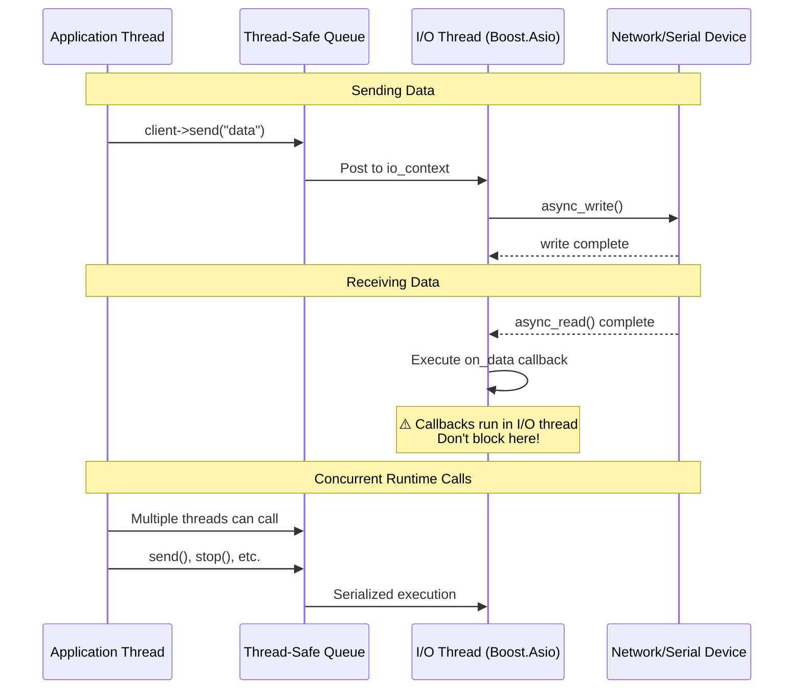
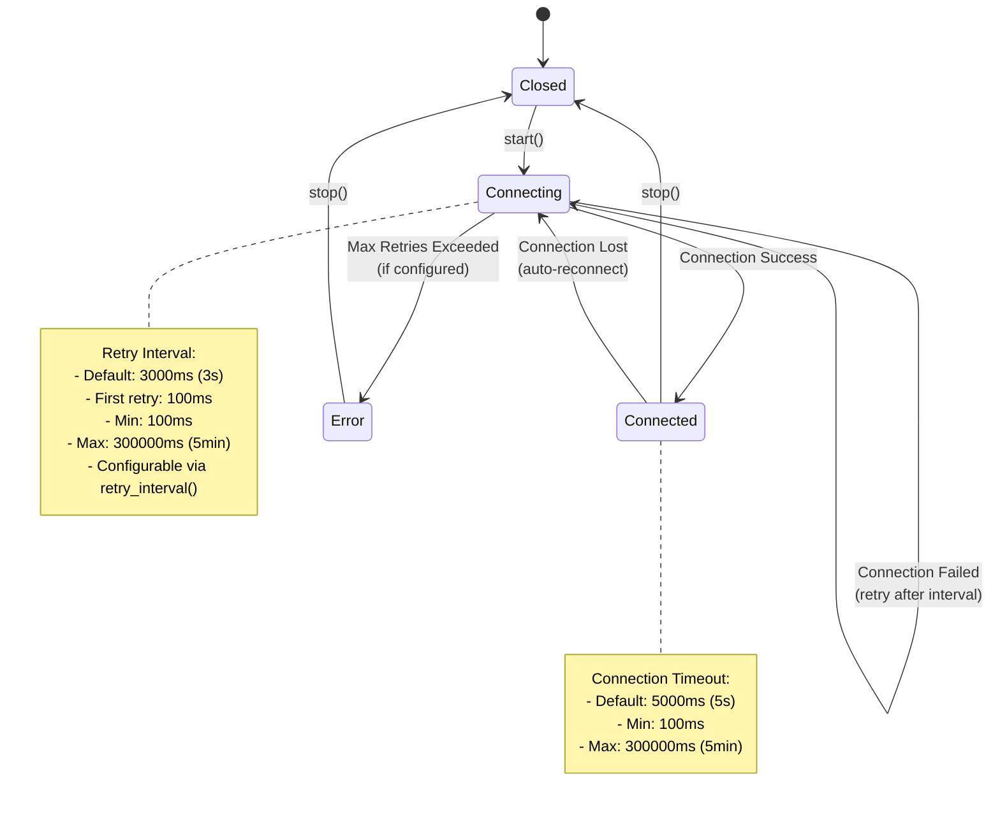
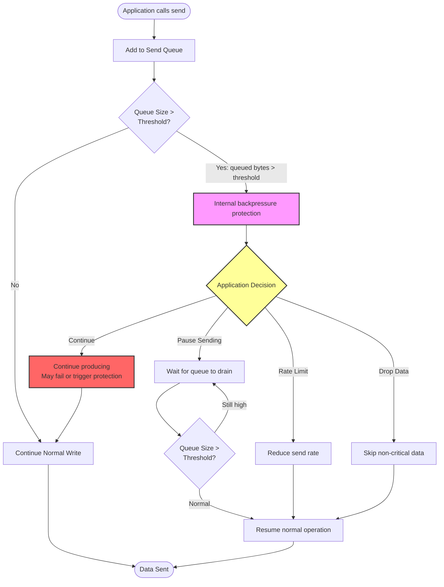

# Runtime Behavior Model {#contrib_arch_runtime}

Understanding how `unilink` operates internally helps you write more efficient and robust applications. This document describes the threading model, reconnection policies, and backpressure handling.

---

## Table of Contents

1. Threading Model & Callback Execution
2. Reconnection Policy & State Machine
3. Backpressure Handling
4. Best Practices

---

## Threading Model & Callback Execution

All I/O operations run in a dedicated I/O thread (Boost.Asio), while user code runs in separate application threads. Callbacks are always executed in the I/O thread context.

### Architecture Diagram



---

### Key Points

#### Concurrent Runtime Methods

Runtime methods intended for concurrent application use are designed to be thread-safe. This includes methods such as `send()`, `try_send()`, `send_line()`, `stop()`, `connected()`, server `send_to()`, server `broadcast()`, and server state inspection helpers where available.

Thread-safe does not mean non-blocking. In `Reliable` mode, `send()` may wait for backpressure to clear. Use `try_send()` for non-blocking producer loops.

```cpp
// Runtime operations are safe to call from multiple application threads.
std::thread t1([&client]() { client->send("data1"); });
std::thread t2([&client]() { client->send("data2"); });
std::thread t3([&client]() { client->stop(); });
```

Callback registration and configuration setters should normally be completed before `start()` or `auto_start(true)`.

**Implementation:**

- Concurrent runtime operations are serialized through `boost::asio::post()`
- Operations are queued and executed in the I/O thread
- No manual locking required by users

---

#### ✅ Callback Execution Context

**Important:** Callbacks execute in the I/O thread context:

```cpp
auto client = unilink::tcp_client("server.com", 8080)
    .on_data([](const unilink::MessageContext& ctx) {
        // ⚠️ This runs in the I/O thread!
        // Don't block here!
        std::cout << "Received: " << ctx.data() << std::endl;
    })
    .build();
```

**Available callbacks:**

- `on_connect()` - Connection established
- `on_disconnect()` - Connection lost
- `on_data()` - Data received
- `on_error()` - Error occurred
- `on_backpressure()` - Sender-side queue pressure changed

Callbacks should be short and non-blocking. If work must be moved to another thread, copy callback-scoped views first.

---

#### ⚠️ Never Block in Callbacks

**Bad - Blocks I/O thread:**

```cpp
.on_data([](const unilink::MessageContext& ctx) {
    // ❌ BAD: Blocks I/O thread
    std::this_thread::sleep_for(std::chrono::seconds(1));
    heavy_computation(ctx.data());
    database_query(ctx.data());  // Blocking I/O
})
```

**Good - Offload to worker threads:**

```cpp
.on_data([](const unilink::MessageContext& ctx) {
    // ✅ GOOD: Offload to worker thread
    std::string payload = ctx.data_as_string();
    std::thread([payload = std::move(payload)]() {
        heavy_computation(payload);
        database_query(payload);
    }).detach();

    // Or use a thread pool
    std::string payload_for_pool = ctx.data_as_string();
    thread_pool.submit([payload = std::move(payload_for_pool)]() {
        heavy_computation(payload);
    });
})
```

**Impact of blocking:**

- Blocks all I/O operations
- Prevents other connections from processing data
- Can cause timeouts and dropped connections
- Reduces throughput by 10-100x

---

#### ✅ Thread-Safe State Access

Use `net::post()` to safely access state from application threads:

```cpp
// Application thread wants to access I/O thread state
boost::asio::post(io_context, [&client]() {
    // Now safely in I/O thread context
    bool connected = client->connected();
    std::cout << "Connected: " << connected << std::endl;
});
```

---

### Threading Model Summary

| Aspect                  | Details                                            |
| ----------------------- | -------------------------------------------------- |
| **I/O Thread**          | Single dedicated thread running `io_context.run()` |
| **Application Threads** | Any number of threads calling runtime operations   |
| **Callback Thread**     | Always I/O thread                                  |
| **Thread Safety**       | Concurrent runtime operations serialized via `post()` |
| **Synchronization**     | Automatic via Boost.Asio                           |

---

## Reconnection Policy & State Machine

TCP clients and Serial connections automatically handle connection failures with configurable retry logic.

### State Machine Diagram



---

### Connection States

| State          | Description                        | Transitions                                                            |
| -------------- | ---------------------------------- | ---------------------------------------------------------------------- |
| **Closed**     | Not started or explicitly stopped  | → Connecting (on `start()`)                                            |
| **Connecting** | Attempting to establish connection | → Connected (success)<br>→ Connecting (retry)<br>→ Error (max retries) |
| **Connected**  | Active connection                  | → Closed (on `stop()`)<br>→ Connecting (connection lost)               |
| **Error**      | Unrecoverable error occurred       | → Closed (on `stop()`)                                                 |

---

### Configuration Example

```cpp
auto client = unilink::tcp_client("server.com", 8080)
    .retry_interval(5000ms)    // Retry every 5 seconds
    .on_connect([](const unilink::ConnectionContext&) {
        std::cout << "Connected!" << std::endl;
    })
    .on_disconnect([](const unilink::ConnectionContext&) {
        std::cout << "Disconnected - will auto-reconnect" << std::endl;
    })
    .build();

client->start();  // Start the connection explicitly
```

---

### Retry Behavior

#### Default Behavior

- **Unlimited retries** with 3-second intervals (first retry after 100ms)
- Automatically reconnects on connection loss
- No exponential backoff (constant interval)

#### Retry Interval Configuration

```cpp
// Fast reconnection (aggressive)
.retry_interval(100)  // 100 ms

// Moderate reconnection (default)
.retry_interval(3000ms)  // 3 seconds

// Slow reconnection (conservative)
.retry_interval(10000ms)  // 10 seconds
```

**Range:** 100 ms - 300,000 ms (5 minutes)

---

#### State Callbacks

Monitor connection state changes:

```cpp
auto client = unilink::tcp_client("server.com", 8080)
    .on_connect([](const unilink::ConnectionContext&) {
        // Connection established
        std::cout << "✅ Connected" << std::endl;
    })
    .on_disconnect([](const unilink::ConnectionContext&) {
        // Connection lost (will auto-reconnect)
        std::cout << "❌ Disconnected" << std::endl;
    })
    .on_error([](const unilink::ErrorContext& ctx) {
        // Error occurred
        std::cout << "⚠️ Error: " << ctx.message() << std::endl;
    })
    .build();
```

---

#### Manual Control

Stop automatic reconnection:

```cpp
// Stop and prevent reconnection
client->stop();

// Check connection status (thread-safe)
bool connected = client->connected();

// Restart connection
client->start();
```

---

### Reconnection Best Practices

#### 1. Choose Appropriate Retry Interval

| Use Case                | Retry Interval | Reason                        |
| ----------------------- | -------------- | ----------------------------- |
| **Local network**       | 1-2 seconds    | Quick recovery                |
| **Internet connection** | 5-10 seconds   | Avoid overwhelming server     |
| **Mobile/unstable**     | 10-30 seconds  | Conserve battery, reduce load |
| **Background service**  | 30-60 seconds  | Minimal resource usage        |

---

#### 2. Handle State Transitions

```cpp
std::atomic<bool> is_ready{false};

auto client = unilink::tcp_client("server.com", 8080)
    .on_connect([&is_ready]() {
        is_ready = true;
        // Initialize resources
    })
    .on_disconnect([&is_ready]() {
        is_ready = false;
        // Cleanup or pause operations
    })
    .build();

// Application code checks is_ready before sending
if (is_ready) {
    client->send("data");
}
```

---

#### 3. Graceful Shutdown

```cpp
// Stop reconnection before exiting
client->stop();

// Wait for I/O thread to finish (automatic in destructor)
client.reset();
```

---

## Backpressure Handling

Backpressure is sender-side queue pressure. When the local outgoing queue grows too large because the transport is slower than the application, `unilink` applies internal backpressure protection in the transport layer. Applications can monitor queue pressure via the wrapper-level `on_backpressure` builder callback where supported, or implement additional rate limiting and queue monitoring at the application level.

Backpressure does not mean the remote peer has processed data. For UDP, it only describes the local sender-side queue because UDP has no receiver-side flow control.

Applications that produce data faster than the transport can send it should choose an explicit policy:

- use `Reliable` when completeness is more important than latency
- use `BestEffort` when freshness is more important than preserving every queued payload
- use `try_send()` when producer threads must not block
- monitor queue pressure and dropped data when available

### Backpressure Flow



---

### Backpressure Configuration

Use transport-layer configuration if you need direct queue-threshold control. At the wrapper level, keep your own send budget and stop producing data when downstream systems slow down.

**Default threshold:** Reliable defaults to 1 MiB; BestEffort defaults to 512 KiB when selected through the builder. Base transport configuration defaults to 1 MiB.
**Configurable range:** 1 KB - 100 MB  
**Safety cap:** ~4x the high watermark (capped at 64 MB) triggers automatic close + Error state

---

### Backpressure Strategies

#### Strategy 1: Pause Sending

Stop sending until queue drains:

```cpp
std::atomic<bool> can_send{true};
std::atomic<size_t> queued_messages{0};

if (queued_messages.load() < 1000 && can_send.load()) {
    client->send(data);
    queued_messages.fetch_add(1);
}
```

**Best for:** Real-time data, can tolerate delays

---

#### Strategy 2: Rate Limiting

Reduce send rate:

```cpp
for (const auto& packet : packets) {
    client->send(packet);
    std::this_thread::sleep_for(std::chrono::milliseconds(10));
}
```

**Best for:** Continuous data streams

---

#### Strategy 3: Drop Data

Skip non-critical data:

```cpp
std::atomic<bool> degraded_mode{false};

if (!degraded_mode.load() || is_critical) {
    client->send(data);
}
```

**Best for:** Non-critical telemetry, logging

---

### Backpressure Monitoring

Track queue size continuously:

```cpp
size_t sent_messages = 0;
size_t dropped_messages = 0;

for (const auto& packet : packets) {
    if (should_send(packet)) {
        client->send(packet);
        ++sent_messages;
    } else {
        ++dropped_messages;
    }
}
```

---

### Memory Safety

Backpressure handling ensures:

- ✅ Queue size is monitored continuously
- ✅ Queue growth is bounded internally in the transport layer
- ✅ Applications can add their own send throttling policy
- ✅ Wrapper-level backpressure notifications are available via the `on_backpressure` builder method where supported
- ✅ Memory pools reduce allocation overhead for small buffers (<64KB)

---

## Best Practices

### 1. Threading Best Practices

#### ✅ DO

- Keep callbacks short and non-blocking
- Offload heavy work to worker threads
- Use thread pools for parallel processing
- Check connection state before sending

#### ❌ DON'T

- Block in callbacks
- Call `sleep()` in callbacks
- Perform database queries in callbacks
- Do heavy computation in callbacks

---

### 2. Reconnection Best Practices

#### ✅ DO

- Set appropriate retry intervals for your use case
- Handle state transitions (connect/disconnect)
- Implement graceful shutdown
- Monitor connection status

#### ❌ DON'T

- Set extremely short retry intervals (<100ms)
- Ignore disconnect callbacks
- Assume connection is always available
- Forget to call `stop()` before cleanup

---

### 3. Backpressure Best Practices

#### ✅ DO

- Monitor backpressure in production
- Implement appropriate handling strategy
- Test with slow networks
- Set reasonable thresholds

#### ❌ DON'T

- Ignore backpressure callbacks
- Assume queue memory is unbounded
- Send without rate limiting
- Forget to handle high-load scenarios

---

## Performance Considerations

### Threading Overhead

- **Callback invocation:** ~1-5 μs overhead
- **Thread-safe API calls:** ~2-10 μs overhead (post to I/O thread)
- **Context switching:** Minimize by batching operations

### Reconnection Overhead

- **TCP connection establishment:** ~10-100 ms
- **Retry timer:** ~0.1 ms overhead per retry
- **Recommendation:** Reuse connections when possible

### Backpressure Overhead

- **Queue monitoring:** Negligible (<0.1% CPU)
- **Callback invocation:** Only when threshold exceeded
- **Memory pools:** ~30% faster for small buffers

---

## Next Steps

- [Memory Safety](memory_safety.md) - Memory safety features
- [System Overview](README.md) - High-level architecture
- [Performance Guide](../../user/performance.md) - Optimization techniques
